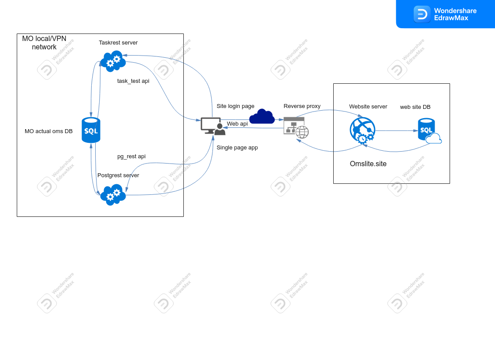

# Локальный деплой

Структура сервиса для конкретной МО выглядит следующим образом:

## Рабочая база данных

[Рабочая база данных](./workdb.md) МО должна быть развернута в защищенной сети МО.
В настоящее время сервис не предоставляет возможности автоматической установки и разворачивания
сервера БД в локальной или виртуальной частной сети МО. Такую установку технический
персонал МО должен выполнять самостоятельно.

После того как локальный сервер БД развернут, нужно создать рабочую БД, добавить роль для
[доступа](./access.md) к БД установить соответствующие права для этой роли. После этого,
необходимо скачать последний [дамп схемы БД](./workdb.md#схема-рабочей-бд) и выполнить
миграцию БД к актуальному состоянию.

По завершении миграции схемы, нужно заполнить общие таблицы базы с помощью последнего
[дампа БД](./workdb.md#дамп-рабочей-бд).

Миграция схемы, загрузка и выгрузка дампа выполняется любым подходящим для этого
инструментом, удобным для тех. персонала МО (например стандартными утилитами __psql__,
**pg_dump**, **pg_restore**).

Далее в локальной сети или в сети VPN должны быть развернуты сервисы __pg_rest__ и
__task_rest__.

## Сервер Postgrest

Web приложение [Postrgrest](./pg_rest.md) желательно разместить на том же хосте, что и
сервер БД. Приложение может быть либо исполняемым файлом для соответствующей ОС, либо в
виде `Docker` образа предоставляемого разработчиком.

### Запуск сервера pg_rest

Запуск сервера может производится из командной строки, однако предпочтительным вариантом
является запуск сервера как системного процесса (сервиса).

#### pg_rest ОС Windows

Для ОС Windows одним возможным вариантом такого запуска будет использование бесплатной
утилиты <a href="https://nssm.cc/" target=_blank>NSSM</a>. Утилита довольно старая, тем не
менее, работает в ОС Windows 10, Windows Server 2016. Вероятно возможны и другие механизмы
"демонизации" приложения. На практике, Postgrest == 2.5.0 хорошо работает с NSSM в ОС 10 и
серверной ОС 2016.

#### pg_rest ОС Linux

Для ОС Linux использующей механизм `systemd` рекомендуется создать файл `pg_rest.service`,
в котором описать процедуру старта и рестарта приложения, и разрешить запуск этого сервиса
при старте системы.

### Тест сервиса pg_rest

Развернутый, сконфигурированный сервер _Postrgrest_ нужно протестировать с помощью любого
доступного инструмента. Например, если сервер доступен по адресу:

    http://192.168.0.10:8080

в адресной строке браузера можно ввести запрос:

    http://192.168.0.10:8080/okato

Ответом на запрос будет текст в формате JSON вида:

    [{"id":1,"region":1,"okato":79000,"name":"Республика Адыгея","okrug":3,"datebeg":"2011-01-01","dateend":null},
    {"id":2,"region":2,"okato":80000,"name":"Республика Башкортостан","okrug":5,"datebeg":"2011-01-01","dateend":null},
    {"id":3,"region":3,"okato":81000,"name":"Республика Бурятия","okrug":7,"datebeg":"2011-01-01","dateend":"2018-11-02"}, ...

Аналогично, сервер можно протестировать с помощью утилиты командной строки
<a href="https://curl.se/" traget=_blank> curl</a>.

    curl 192.168.0.10:7000/okato

## Сервер Taskrest

Web приложение Taskrest является WSGI приложением написанным на языке `Python >= 3.6.8.`
Рекомендуется использовать версию интерпретатора `Python` не ниже версии `3.8.1`.

Варианты деплоя приложения:

1. приложение запускаемое из командной строки;
2. системный процесс запускаемый как сервис ОС;
3. web сайт по управлением web сервера общего назначения (IIS, nginx, apache);
4. `Docker` контейнер.

В случаях 1-3 рекомендуется развернуть приложение в виртуальном окружении Python.
Все необходимые зависимости приложения указаны в файле `requirements.txt` в
[репозитории](https://github.com/SLikhachev/task_rest).

Для работы приложения необходима библиотека [barsxml](./barsxml.md).

Технические подробности развертывания приложения описаны в разделе [task_rest](./task_rest.md).

### Запуск сервера task_rest

Запуск сервера может производится из командной строки как в виде __Flask__ приложения под
управления сервера разработки __Flask__, либо как субпроцесс сервера <a href="https://gunicorn.org/" target=_blank>__gunicorn__</a> (ОС Linux). Однако, предпочтительным вариантом является запуск сервера как системного процесса (сервиса).

#### task_rest ОС Windows

Для ОС Windows *task_rest* рекомендуется запускать как web сайт локального сервера `IIS >= 7`
версии в виде `FastCGI` приложения. Более подробную информацию о развертывании `IIS FastCGI`
приложения можно найти на сайте <a href="https://docs.microsoft.com" target=_blank>docs.microsoft.com</a>.

Например: <a href="https://docs.microsoft.com/ru-ru/visualstudio/python/configure-web-apps-for-iis-windows?view=vs-2022" target=_blank>Настройка веб-приложений Python для IIS</a>.

#### task_rest ОС Linux

В ОС Linux рекомендуется запускать рабочий сервер как субпроцесс сервера <a href="https://gunicorn.org/" target=_blank>__gunicorn__</a>.

Если ОС Linux использующей механизм `systemd` рекомендуется создать файл `task_rest.service`,
в котором описать процедуру старта и рестарта сервера, и разрешить запуск этого сервиса
при старте системы.

### Тест сервиса task_rest

Развернутый, сконфигурированный сервер _Taskrest_ нужно протестировать с помощью любого
доступного инструмента. Например, если сервер доступен по адресу:

    http://192.168.0.11:8989

в адресной строке браузера можно ввести запрос:

    http://192.168.0.11:8989/test_task

Ответом на запрос будет простой текст вида:

    Task accessible

Для теста соединения task_rest с рабочей БД:

    http://192.168.0.11:8989/test_db

Ответом на запрос будет простой текст вида:

    DB accessible
