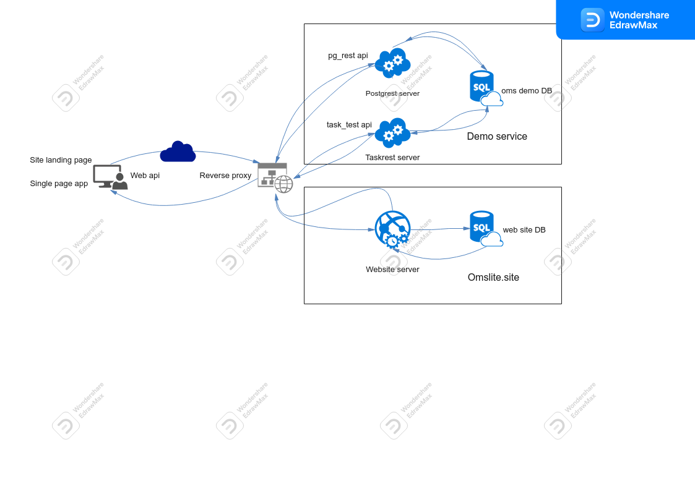
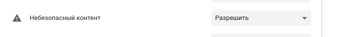
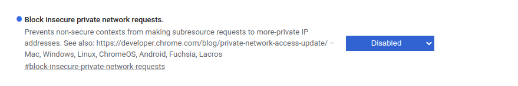
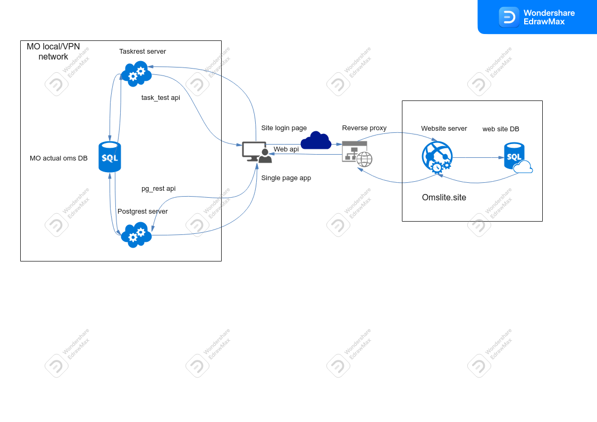

# Структура сервиса

Сервис организован в виде нескольких независимых приложений, передающих запросы и
получающих ответы по протоколу HTTP(S). Любое сервисное приложение можно развернуть
на отдельном вычислительном узле, или все, или часть приложений можно развернуть на
одном общем узле.

## Структура Демо сервиса

Основные приложения:

1. Браузер пользователя;
2. Web сайт omslite.site;
3. Сервер [Postgrest](./pg_rest.md);
4. Сервер [Taskrest](./task_rest.md).

### Браузер пользователя

Доступ к сервису и приложениям реализован по протоколу HTTP(S), для конечного
пользователя взаимодействие с сайтом и приложениями происходят в веб браузере на локальном ПК совершенно прозрачно. Для работы с Демо сервисом подходит любой свежий браузер
(рекомендуется браузер на основе Chromium). Для Демо сервиса не требуется никаких дополнительных настроек браузера.

Для сервисов [pg_rest](./pg_rest.md) и [task_rest](./task_rest.md) развернутых в локальной или виртуальной частной [сети](./local_deploy.md), в настройках браузера необходимо разрешить
выполнение [CORS](https://developer.mozilla.org/ru/docs/Web/HTTP/CORS) запросов к ресурсам
этих сервисов, поскольку такие запросы выполняют [SPA](./spa.md) приложения
доставленные в браузер запросом к домену `omslite.site`.

### Web сайт omslite.site

Сайт [omslite.site](../user/omsite.md) представляет собой простое веб приложение выполненное с помощью фреймворка [Django](https://www.djangoproject.com/).
Фактически, основная функция сайта, регистрация и в дальнейшем аутентификация пользователей,
и доставка в браузер на локальный ПК одностраничных приложений.

Сайт доступен по 2-м URL (собственно это 2 разных сайта):

- Основная станица сайта - лэндинг <a href="https://omslite.site" target=_blank>omslite.site</a>
- Страница быстрого логина <a href="https://local.omslite.site" target=_blank>local.omslite.site</a>

### Протокол HTTPS и локальные сервисы

Если серверы **pg_rest** и/или **task_rest** развернуты в локальной и/или виртуальной
частной сети, и доступны по протоколу HTTP, то при обращении к ним SPA, современный браузер
будет блокировать доступ. Для того, чтобы разрешить доступ к этим сервисам, нужно:

- либо использовать протокол HTTPS, и соответсвенно настроить локальные WEB серверы,
- либо разрешить браузеру пользователя доступ к смешанному контенту по 2-м разным протоколам.

Настройка локальных серверов для использования **HTTPS** выполняются администратором МО.

Для того, чтобы разрешить браузеру доступ к смешанному контенту, нужно изменить настройки
в самом браузере. Например, для браузера _Google Chrome_ версии 100 и выше, в настройках сайта
_omslite.site_ разрешите небезопасный контент:

В глобальных настройках бразура по адресу **chrome://flags** нужно убрать блокировку
небезопасных запросов в частных сетях:

При настройках _Google Chrome_ как указано выше сайт _omslite.site_ будет помечен как
небезопасный:

Следует обратить внимание, на следующие обстоятельства:

- аутентификация пользователя на сайте и доставка скриптов SPA производится по защищенному
протоколу TLSv1.1/TLSv1.2;
- обмен данными между браузером и локальными сервисами должен происходить в рамках
периметра безопасности инфраструктуры МО (ответвенность администратора МО);
- если обращение к сервисам выполняется по адресам 127.0.0.1:port, в этом случае, браузер
не блокирует доступ, и соеденинеие считается безопасным.

Сайт _omslite.site_ использует бесплатный SSL сертификат **Let's Encrypt**, возобновляемый
каждые 3 месяца. Возможно, что некоторые старые ОС (Windows7, 8, 2008, и т.д.) не имеют
в своих хранилищах действующего корневого сертификата удостоверяющего центра
**ISRG Root X1**. В этом случае следует скачать и установить корневой сертификат этого
удовстоверяющего центра.

## Структура сервиса МО, обратная связь

Любая МО может быть зарегистрирована на сайте в [настройках МО](../service/mo_register.md).
Перед регистрацией нужно выполнить ряд технических работ по
[локальному деплою компонентов](./local_deploy.md), и тестированию развернутых сервисов.

После разворачивания локальных сервисов, структура сервиса МО выглядит следующим образом:

Администратор сайта **omslite.site**, может самостоятельно развернуть и протестировать
сервисы для МО. Такая услуга может быть оказана на платной основе. По всем вопросам,
в отношении сайта, услуг, замечаний или пожеланий просим обращаться на электропочту:

<a mailto="zeroms@inbox.ru">zeroms@inbox.ru</a>.
