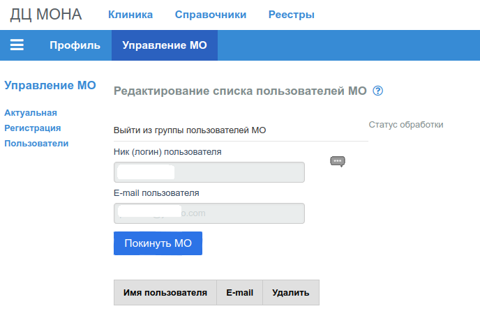

# Настройки профиля МО

__Профиль МО__ - набор реквизитов, которые используются [SPA приложениям](../user/omsite.md#spa)
для

- вывода страниц интерфейса пользователя;
- доступа к сервисам [pg_rest](../admin/pg_rest.md) и [task_rest](../admin/task_rest.md);
- корректной работы приложений при выполнения запросов к сервисам.

Реквизиты профиля:

1. Код МО - уникальный цифровой или буквенно-цифровой код, однозначно идентифицирующий МО;
2. Имя МО - Имя отображаемое в левом верхнем углу каждого приложения;
3. ТФОМС - код [ТФОМС](../user/sprav/comm.md#f001) регулирующий деятельность МО по ОМС;
4. Адрес сервера [pg_rest](../admin/pg_rest.md) - URL по которому доступен сервер PG_REST;
5. Адрес сервера [task_rest](../admin/pg_rest.md) - URL по которому доступен сервер TASK_REST;
6. Имя роли локальной сессии БД как описано в разделе [Контроль доступа](../admin/access.md)
7. Секретный ключ для подписи токенов [JWT](../admin/jwt_auth.md).

Каждый Профиль принадлежит __только одному Пользователю__, поэтому, последним реквизитом
Профиля является имя Пользователя - автора данного профиля МО.

Последний реквизит присваивается Профилю автоматически, и не может быть изменен.

По умолчанию, Пользователю только что зарегистрированному на сайте и не имеющему
собственного профиля МО, текущим Профилем назначается профиль [Демо МО](../user/demodb.md).

Если Пользователь, не имеющий своего Профиля, был привязан (предполагается, что
с согласия Пользователя) к Профилю отличному от Демо МО, текущим Профилем будет считаться
тот, к которому он был привязан. Более подробно: [Пользователи](#users).

Однажды зарегистрированный профиль МО нельзя удалить, можно только откорректировать.

## Актуальная МО

В этом разделе, перечислены реквизиты текущего Профиля МО Пользователя. Реквизиты 6 и
7 (роль БД и ключ для JWT) не указываются.

## Регистрация МО

Раздел предназначен для регистрации нового Профиля, или корректировки текущего.
Если Пользователь является собственником Профиля, то все поля формы будут заполнены и
доступны для изменения. Если Пользователь не является собственником, поля формы будут
пустыми.

При заполнении пустых полей и сохранении формы, в БД сайта формируется новая запись
о Профиле с реквизитами указанными в форме, и собственником Профиля будет Пользователь
его создавший.

После успешного создания нового или изменения текущего Профиля, принудительно
завершается текущий сеанс работы Пользователя, и производится редирект на страницу логина.

(Последние 2 реквизита на картинке не указаны)

## Users. Пользователи МО

Для каждого зарегистрированного на сайте Пользователя есть один, и только один актуальный
Профиль МО. Действуют следующие правила по которым Пользователю назначается
Профиль МО:

1. Только что зарегистрировавшийся на сайте Пользователь получает Профиль
[Демо МО](../user/demodb.md);

2. Для Пользователя зарегистрировавшего (создавшего) собственный Профиль,
этот Профиль навсегда становится актуальным;

3. Если собственник Профиля, присоединил к себе другого Пользователя, то для
присоединенного Пользователя такой Профиль становится актуальным, не зависимо от того,
какой Профиль был у него до присоединения;

4. Если собственник Профиля удаляет присоединенного Пользователя,

5. Если присоединенный Пользователь сам покидает МО к которому присоединен, тогда ему
назначается профиль Демо МО.

Владелец Профиля (админ Профиля) имеет возможность добавить к Профилю Пользователя
или удалить присоединенного Пользователя из Профиля.

### Присоединить (добавить) Пользователя к МО

Для того чтобы добавить (присоединить) Пользователя к МО в разделе "Пользователи" редактора
Профиля МО, в форму нужно ввести ник (логин) и e-mail Пользователя зарегистрированного
на сайте.

Если такой Пользователю не является собственником другого профиля, для него актуальной МО устанавливается редактируемая.

Предполагается, что присоединяемый пользователь согласен с тем, что его актуальной МО будет
данная редактируемая МО.

### Удалить Пользователя

Чтобы удалить присоединенного Пользователя, нужно в последней колонке таблицы со списком
Пользователей кликнуть на иконку "Удалить" (красный круг).

### Покинуть МО

Если Пользователь был присоединен к МО владельцем Профиля МО, то такой Пользователь
может покинуть этот Профиль. После того как Пользователь покинул Профиль, актуальным
для него становиться профиль Демо МО.

