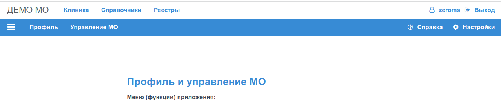

# Регистрация МО профиль Пользователя

Демо МО, настройки и рабочая база данных которого, находятся на сервере хостинга сайта
*omslite.site*, предназначена __исключительно__ для ознакомления с функциями приложений
и сервисов. Демо МО не предназначена для работы с непубличными данными, не следует
заносить в базу и хранить в этой базе любые данные, которы можно считать сейчас или,
которые в будущем могут считаться конфиденциальными, относящиеся к персональным
данным, доступ к которым должен быть ограничен в соответствии с действующим
законодательством РФ и/или регламентными документами МО.

Для настройки доступа к локальным сервисам МО развернутым администратором МО в
локальной или виртуальной частной сети, предназначено приложение "Настройки", которое
загружается в браузер пользователя по клику на пункт меню "Настройки", расположенному в
правом верхнем углу меню всех доступных приложений.

Приложение "Настройки" предоставляет возможности:

1. [Настройка профиля пользователя](./user_profile.md)
2. [Настройка профиля МО](./mo_profile.md)

При любом изменении действующих настроек профиля, перед сохранением настроек,
Пользователь должен подтвердить свое действие простым нажатием на конку "ОК" на модальном
окне нативного элемента __window.confirm__ браузера.
