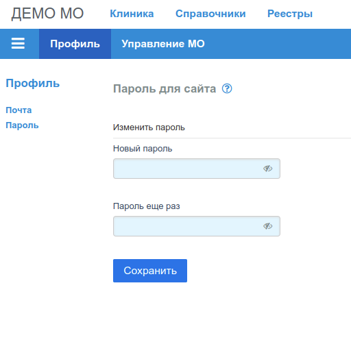

# Настройки профиля Пользователя

Пункт меню "Профиль" предназначен для изменения:

- адреса электронной почты;
- пароля Пользователя.

Ник (логин) Пользователя изменить невозможно.

## Изменение адреса электропочты

Для изменения адреса необходимо ввести новый адрес электропочты и кликнуть по кнопке
__"Сохранить"__. Приложение никак не проверяет наличие или доступность введенного адреса,
производится проверка корректности строки на соответствие шаблону, и строка сохраняется
в базе данных.

## Изменение текущего пароля

Для изменения текущего пароля, необходимо ввести новый пароль два раза в поля формы
и и кликнуть по кнопке __"Сохранить"__. Пароль используется исключительно для доступа к
сайту _omslite.site_, [SPA приложениям](../user/omsite.md#spa) и
и настройкам текущего [МО Пользователя](./mo_profile.md).

Приложение не ограничивает Пользователя в выборе сложности пароля, вся ответственность за
стойкость пароля возлагается на Пользователя.

После подтверждения действия, хэш нового пароля сохраняется БД сайта,принудительно
завершается текущий сеанс работы Пользователя, и производится редирект на страницу логина.
