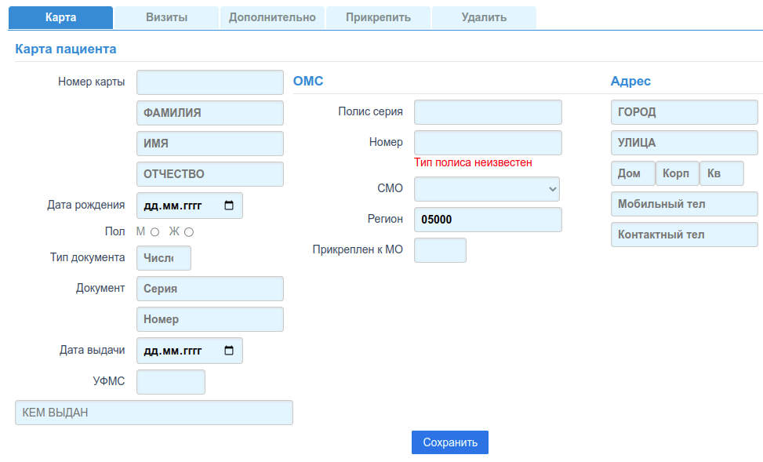
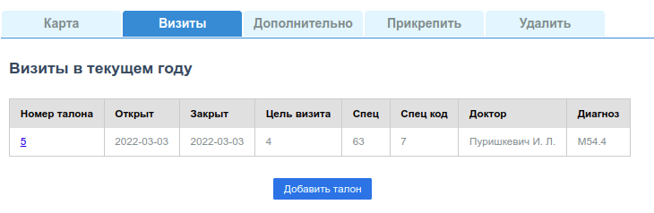
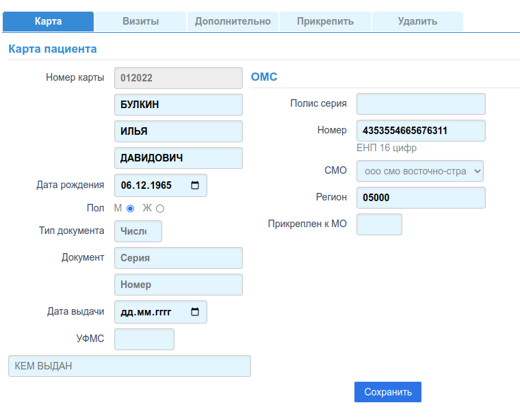

# Редактор карт

Для добавления или изменения данных пациента, предназначена одна и та же форма.

## Добавление карты

Форма для добавления:

### Вкладка "Карта"

Данная вкладка является основной. Поля формы разбиты на три группы. Если какое либо
обязательное поле не заполнено, или заполнено не корректно, то после клика по кнопке
*"Сохранить"*, оператор увидит модальное окно с описанием ошибки. Для создания карты
нужно заполнить все обязательные поля формы и кликнуть по кнопке *"Сохранить"*.
Последовательное перемещение по полям фомы можно выполнять либо по клавише
**"TAB"**, либо по клавише **"ENTER"**. Однако при переходе с группы на группу полей,
клавиша **"ENTER"** теряет фокус.

#### Номер карты

Вводимый номер карты должен соответствовать ["Шаблону"](../sprav/local.md#шаблоны-номеров). Соответствие шаблону проверяется
при сохранении карты. В приложении не предусмотрен механизм генерирования очередного
номера карты, поскольку считается, что данное приложения является вспомогательным, и
генерирование последовательных номеров карт выполняется в основной МИС МО.

#### ФИО

Обязательным является только поле *"Фамилия"*, *"Имя"* или *"Отчество"* могут отсутсвовать,
например (Фамилия: **"Пак Сун Хо"** или  Фамилия: **"Пак"**, Имя: **"Сун-Хо"** и т. д.).

#### Тип документа

При отсутствии у пациента **действующего полиса Единого образца** с 16-ти значным номером,
необходимо заполнить поля ДУЛ (документа удостоверяющего личность). В поле
["Тип документа"](../sprav/comm.md#дул-по-f011-документ-удостоверяющий-личность)
нужно ввести число соответствующее типу документа (Например: 14 для Паспорта РФ).

Поля *"Серия"*, *"Номер"*, *"Дата выдачи"*, необходимо заполонять по шаблонам указанным в
справочнике ["Тип документа"](../sprav/comm.md#дул-по-f011-документ-удостоверяющий-личность).

Если ДУЛ, это паспорт:

- поле *"Серия"* заполняется с пробелом (например: "01 02")
- поле *"УФМС"*, заполняется подряд 6 цифрами кода УФМС выдавшего паспорт (без дефиса)

Если поле УФМС заполнено корректно, то приложение запрашивает наименование данного
управления ФМС в справочнике, и найденное автоматически заносится в поле формы
*"Кем выдан"*.

Если код УФМС не найден в справочнике, необходимо самостоятельно заполнить поле
*"Кем выдан"*, в соответствии с тем, что указано в предъявленном документе.

Справочник УФМС не доступен для редактирования, и автоматического обновления.
Порядок обновления и/или редактирования служебных справочников описан в разделе
["Служебные справочники"](../../admin/workdb.md)

#### Серия, Номер полиса ОМС (факт страхования)

Для старых действующих полисов ОМС, в которых присутствует *"Серия"* и *"Номер"*,
необходимо их указать в полях формы (группа ОМС). Для плисов ОМС с Единым
(16-ти разрядным) Номером Полиса (ЕНП), или для Временных (9-ти разрядных)
Свидетельств (ВС), поле "Номер" нужно заполнить номером ЕНП/ВС соответственно,
поле *"Серия"* остается не заполненным.

#### СМО, Регион страхования

В Демо БД Регион страхования заранее задан как *"05000 - Приморский край"*, и
соответственно выбор СМО ограничен 2 СМО действующими в этом регионе, согласно
справочнику ["СМО РФ по F002"](../sprav/comm.md#смо-рф-по-f002). Автоматическая
установка региона страхования описана в техничском разделе для администраторов
["Конфигурация](../../admin/local_deploy.md).

Выбор произвольного региона страхования выполняется в поле *"Регион"*, для этого
нужно ввести в поле **наименование региона** (Например: "Ставропольский"), и выбрать из
предлагаемого списка регионов. После того, как регион выбран, в выпадающем списке
*"СМО"*, будут перечислены СМО зарегистрированные в данном регионе.

#### Прикреплен к МО

Данное поле не обязательно. Заполняется коротким кодом МО (3 цифры) из справочника
["МО локальные"](../sprav/local.md#мо-локальные).

#### Адрес

Все поля этой группы не являются обязательными.

### Вкладка визиты

Данная вкладка актуальна только для уже сохраненных карт.

Вид вкладки:

На вкладке расположена таблица с перечислением талонов текущего/установленного
года для данного пациента.

Номер талона - ссылка на ["Форму редактирования талона"](./talons_edit.md).
Под таблицей расположена кнопка *"Добавить талон"*, по клику по этой кнопке
открывается форма редактирования нового талона.

### Вкладки Дополнительно, Прикрепить, Удалить

В действующей версии приложения данные вкладки не актуальны.

## Изменение карты

Вид формы с частично заполненными полями:

Все выше сказанное в [Добавлении карты](#добавление-карты), относится и к данному разделу.

### Изменение номера карты

В Демо БД, если для данной карты есть хотя бы один талон, номер карты изменить нельзя,
и поэтому, это поле в форме не доступно для изменения. Если талонов нет, то поле
редактировать можно.

В рабочей БД МО, вопрос об изменении номеров карт решает администратор системы.
