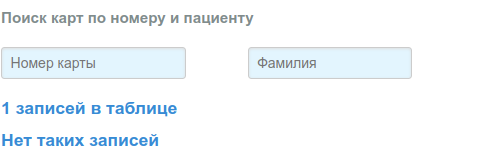

# Поиск карт, новая карта/талон

Пункт **"Карты"** основного меню приложения:

На странице выводится общее количество записей в таблице. Поиск выполняется либо
по одному критерию (номер карты, фамилия, имя), либо по нескольким, если заполнены
соответствующие поля ввода, по клику на кнопку *"Найти"*.

Форма для заполнения новой карты открывается по клику
на кнопку [**"Новая карта"**](cards_edit.md).

## Год талонов

По умолчанию при загрузке приложения в браузер годом талонов считается текущий год.
При необходимости работы с талонами предыдущих периодов, в поле *"Год талонов"*
нужно выбрать соответствующий год, и прейти в пункт меню [**"Визиты"**](talons_find.md).

## Список найденных карт

### Карта не найдена

Если в таблице не найдено карт удовлетворяющих критериям поиска, выводится сообщение
**"Нет таких записей"**:

### Найденные карты

Найденные карты (первые 50 записей) выводятся в виде таблицы:

Первая колонка *"Карта"* содержит ссылку на форму редактирования данный карты. В последней
колонке таблицы *"Новый талон"* размещена иконка в виде зеленого круга с `+`, клик по
иконке открывает ["Форму редактирования нового талона"](./talons_edit.md).
