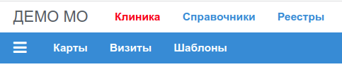

# Клиника (пациенты и талоны)

Вид основного меню Приложения:

Приложение "Клиника" служит для внесения записей о принятых в МО пациентах и
оказанных им услугах по ОМС. Учет пациентов ведется в одной таблице БД. Учет приемов и
услуг ведется по годам, т.е. прием и услуги выполненные в 2020, 2021 и т.д. годах,
записываются в разные таблицы каждая для своего года соответственно.

Указанный порядок учета обусловлен тем, что достаточно часто требования к перечню
предоставляемой в отчетах информации меняется. И такие изменения приурочены как правило
к началу очередного года. Для того, чтобы кардинально не менять структуру единственной
таблицы, в которой будут все записи о приемах, мы ведем учет по годам, и при этом понятно,
что структура таблицы предыдущего года, может отличаться от таблицы следующего.

В демонстрационной базе каждый пользователь имеет доступ только к тем записям, которые он
вносил. Записи других пользователей ему не доступны. В рабочей базе МО, с другой стороны,
можно либо также контролировать доступ пользователей к отдельным записям, либо
такой контроль не выполнять. Контроль за доступом выполняют сервисы
[**pg_rest**](../../admin/pg_rest.md) и [**task_rest**](../../admin/task_rest.md), соответственно,
конфигурируя эти сервисы мы можем контролировать доступ.
Более подробная информация изложена на странице [Контроль доступа](../../admin/access.md)
в разделе *"Технические детали"*.

Основные функции приложения:

1. Поиск карт пациентов [Поиск карт](./cards_find.md)
2. Внесение/Изменение данных пациента [Редактор карт](./cards_edit.md)
3. Поиск талонов [Поиск талонов](./talons_find.md)
4. Внесение/изменение талонов [Редактор талонов](./talons_edit.md)
5. Внесение/изменение шаблонов [Редактор шаблонов](./tmpls_edit.md)
