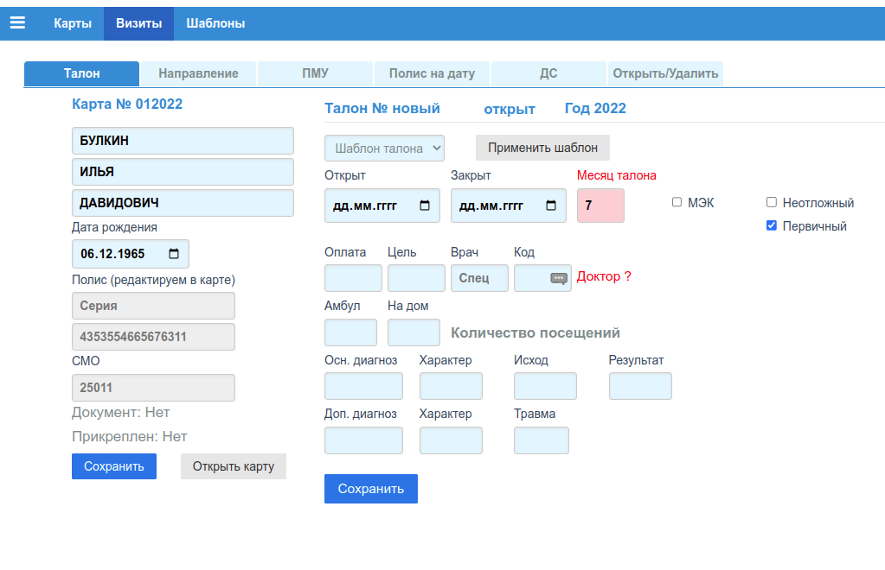

# Редактор талонов

Для добавления или изменения данных о визите пациента (талоне), предназначена одна и
таже форма.

## Новый талон

Форма для добавления талона:

### Вкладка "Талон"

Данная вкладка является основной. На вскладке размещены две независимые формы: "Карта" и
"Талон". Если какое либо обязательное поле в одной из форм не заполнено, или заполнено не корректно, то после клика по кнопке *"Сохранить"* этой формы, оператор увидит модальное окно
с описанием ошибки. Последовательное перемещение по полям форм можно выполнять либо
по клавише **"TAB"**, либо по клавише **"ENTER"**. Однако при преходе с группы на
группу полей, клавиша **"ENTER"** теряет фокус.

#### Форма "Карта"

В форме "Карта", можно редактировать 4 поля карты пациента. Сохранение изменений в карте
выполняется кликом по кнопке *"Сохранить"* этой формы. Открыть карту для редактирования
можно кликом по кнопке *"Открыть карту"*.

#### Форма "Талон"

Создаваемый талон не имеет до момента сохранения не имеет номера и даты. Эти реквизиты
присваиваются при сохранении.

##### Статус талона

Любой талон в базе имеет поле в которм указан статус талона: *"Открыт"/"Закрыт"*. Отрытый
талон **можно редактировать**, закрытый талон **не редактируется** (нет кнопки *"Сохранить"*).
При создании статус талона по умолчанию *"Открыт"*. Изменить статус можно на вкладке
["Открыть/Удалить"](). Следует иметь ввиду, что закрытые талоны можно не включать в
формируемый для ФОМС реестр.

##### Шаблоны талонов

Для быстого заполнения стандатных полей формы талона, можно воспользоваься заранее
созданным шаблоном, работа с которыми описана в разделе ["Шаблоны"](tmpl_edit.md).

Для того, чтобы заполнить форму шалоном, нужно выбрать подходящий шаблон из списка
*"Шаблон талона"* и кликнуть по кнопке *"Применть шаблон"*.

##### Даты, месяц талона

Даты можно заполнить с помощью нативного виджета браузера календарь (поля типа дата).
Поле *"Месяц талона"* (розовое поле), указывает к какому отчетному месяцу относится талон.
При формировании реестра в ФОМС за определенный месяц, если число (от 1 до 12)
*"Месяц талона"* соответвует номеру месяца за который формируется отчет, данный талон в
отчет включается.

##### МЭК

Чекбокс *"МЭК"* указывает на то, по данному талону (случаю) при сдаче реестра в ТФОМС,
после выполнения МедикоЭкономического Контроля, по какой либо причине, было отказано
в оплате случая. Данный чекбокс устанавливается автоматически, после принятия счет-реестра выгружаемого из МИС ТФОМС. Если этот флаг установлен и формируется реестр в ТФОМС
за месяц, соответвующий месяцу талона, то в файле реестра для данного случая будет
установлен признак повторной подачи случая к оплате.

##### Неотложный, Первичный

Для диагностики КТ, МРТ, все случаи являются Плановыми (чекбокс *"Неотложный"*
не установлен) и Первичными (чекбокс *"Первичный"* установлен). Не рекомендуется
устанавливать эти признаки по другому.

##### Оплата, Цель, Врач, Код

Поля формы Оплата и Цель для диагностики должны быть 1-ОМС и 4-Профосмотры
соответсвенно. Во всех остальных случаях необходима консультация медицинского
статистика, работающего в МО.

Поля *"Врач"* и *"Код"* устанавливются в соответвии со справочником ["Врачи"](../sprav/local.md#врачи). В поле *"Врач"* вносится число - "Специальность", в поле *"Код"* число - "Код"
из локального справочника ["Врачи"](../sprav/local.md#врачи).

##### Количество посещений

