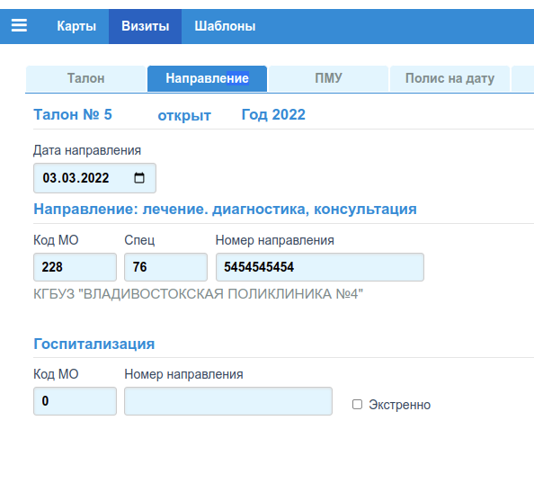
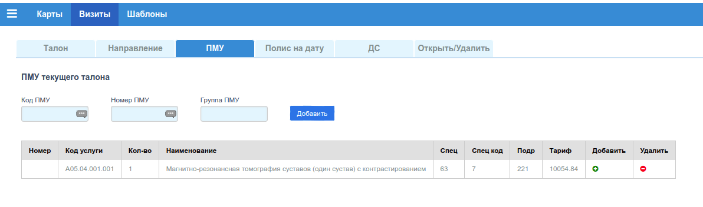
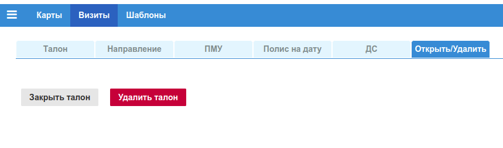

# Редактор талонов

Для добавления или изменения данных о визите пациента (талоне), предназначена одна и
та же форма.

## Новый талон

Форма для добавления талона:

### Вкладка "Талон"

Данная вкладка является основной. На выкладке размещены две независимые формы: "Карта" и
"Талон". Если какое либо обязательное поле в одной из форм не заполнено, или заполнено не корректно, то после клика по кнопке *"Сохранить"* этой формы, оператор увидит модальное окно
с описанием ошибки. Последовательное перемещение по полям форм можно выполнять либо
по клавише **"TAB"**, либо по клавише **"ENTER"**. Однако при переходе с группы на
группу полей, клавиша **"ENTER"** теряет фокус.

#### Форма "Карта"

В форме "Карта", можно редактировать 4 поля карты пациента. Сохранение изменений в карте
выполняется кликом по кнопке *"Сохранить"* этой формы. Открыть карту для редактирования
можно кликом по кнопке *"Открыть карту"*.

#### Форма "Талон"

Создаваемый талон не имеет до момента сохранения не имеет номера и даты. Эти реквизиты
присваиваются при сохранении.

##### Статус талона

Любой талон в базе имеет поле в котором указан статус талона: *"Открыт"/"Закрыт"*. Отрытый
талон **можно редактировать**, закрытый талон **не редактируется** (нет кнопки *"Сохранить"*).
При создании статус талона по умолчанию *"Открыт"*. Изменить статус можно на вкладке
["Открыть/Удалить"](#вкладка-открыть-удалить). Следует иметь ввиду, что закрытые талоны
можно не включать в формируемый для ФОМС реестр.

##### Шаблоны талонов

Для быстрого заполнения стандартных полей формы талона, можно воспользоваться заранее
созданным шаблоном, работа с которыми описана в разделе ["Шаблоны"](./tmpls_edit.md).

Для того, чтобы заполнить форму шаблоном, нужно выбрать подходящий шаблон из списка
*"Шаблон талона"* и кликнуть по кнопке *"Применить шаблон"*.

##### Даты, месяц талона

Даты можно заполнить с помощью нативного виджета браузера календарь (поля типа дата).
Поле *"Месяц талона"* (розовое поле), указывает к какому отчетному месяцу относится талон.
При формировании реестра в ФОМС за определенный месяц, если число (от 1 до 12)
*"Месяц талона"* соответствует номеру месяца за который формируется отчет, данный талон в
отчет включается.

##### МЭК

Чекбокс *"МЭК"* указывает на то, по данному талону (случаю) при сдаче реестра в ТФОМС,
после выполнения МедикоЭкономического Контроля, по какой либо причине, было отказано
в оплате случая. Данный чекбокс устанавливается автоматически, после принятия счет-реестра выгружаемого из МИС ТФОМС. Если этот флаг установлен и формируется реестр в ТФОМС
за месяц, соответствующий месяцу талона, то в файле реестра для данного случая будет
установлен признак повторной подачи случая к оплате.

##### Неотложный, Первичный

Для диагностики КТ, МРТ, все случаи являются Плановыми (чекбокс *"Неотложный"*
не установлен) и Первичными (чекбокс *"Первичный"* установлен). Не рекомендуется
устанавливать эти признаки по другому.

##### Оплата, Цель, Врач, Код

Поля формы *"Оплата"* и *"Цель"* для диагностики должны быть **1-ОМС** и
**4-Профосмотры** соответственно. Во всех остальных случаях необходима консультация
медицинского статистика, работающего в МО.

Поля *"Врач"* и *"Код"* устанавливаются в соответствии со справочником ["Врачи"](../sprav/local.md#врачи). В поле *"Врач"* вносится число - *"Специальность"*, в поле *"Код"* число - *"Код"*
из локального справочника ["Врачи"](../sprav/local.md#врачи).

##### Количество посещений

Для целей диагностики число амбулаторных посещений **1**, посещений на дому **0**.

##### Диагноз, Характер, Исход, Результат

Для заполнения поля *"Диагноз"*, необходимо ввести не менее 3 символов в поле (не зависимо
на русском или английском языке ввода) и выбрать подходящий диагноз из предлагаемого списка.

Для корректного формирования **диагностическим центрами** отчетов в ТФОМС Приморского края,
должны быть установлены следующие поля:

- *"Характер"*: 1 (острое заболевание);
- *"Исход"*: 4 (без перемен);
- *"Результат"*: 14 (динамическое наблюдение).

Во всех остальных случаях (не диагностика, не Приморский край) необходима консультация
медицинского статистика, работающего в МО.

---

>##### Шаблоны
>
>Для ускорения процедуры заполнения талона, поля:
>
>- Неотложный, Первичный
>- Оплата, Цель, Врач, Код
>- Количество посещений
>- Характер, Исход, Результат
>
>рекомендуется заполнить в ["Шаблонах"](./tmpls_edit.md). и в дальнейшем применять к новому
>талону такие "*Шаблоны"*.

---

### Вкладка Направление

Поскольку приложение предназначено для формирования отчетов для диагностических центров,
все исследования выполняются на основании направлений из других МО региона. На этой
вкладке необходимо заполнить поля только раздела *"Направление"*

#### Дата направления

Поле *"Дата"* заполняется либо реальной датой направления на исследование, либо оставляйте
пустым. В последнем случае, в это поле будет автоматически поставлена дата открытия талона
(вкладка *"Талон"*).

#### Код МО, Специалист, Номер направления

Поле *"Код МО"* заполняется коротким кодом МО (3 цифры) из справочника
["МО локальные"](../sprav/local.md#мо-локальные).

Поле *"Спец"* заполняется значение поля *"Код"* справочника ["Специальности"](../sprav/prof.md#специальности).

Поле *"Номер направления"* заполняется значением номера реального направления на
исследование

Например, заполненные поля:

- *"Код МО"*: 228;
- *"Спец"*: 76 (терапевт);
- *"Номер направления"*: 228022021

---

### Вкладка ПМУ

На вкладке вводится вид КТ, МРТ исследований выполненных пациенту. Пока новый талон
не сохранен, ввести код исследования невозможно. После первичного сохранения талона, ему
присваивается порядковый номер и вкладка будет разблокирована.

Выбор ПМУ можно сделать по одному из реквизитов:

- Код ПМУ;
- Номер ПМУ;
- Группа ПМУ.

**Выбор выполняется по первому не пустому полю формы выбора.**

.

#### Выбор ПМУ по Коду

В первое поле требуется ввести первые 6 символов кода услуги (например: A05.03),
ввод можно выполнять на любом регистре и любом языке (русский, английски), приложение
автоматически транслитирирует вводимые символы. По первым 6 символам из справочника
[ПМУ](../sprav/pmu.md#пму-прстые-мед-услуги) выбирается набор ПМУ начинающихся
с введенных 6 символов, и предлагается список, для дальнейшего выбора.

#### Выбор ПМУ по номеру

Для ускорения выбора ПМУ, определенному коду можно присвоить произвольное число -
номер ПМУ. В таком случае первое поле можно не заполнять, а заполнить второе поле таким
номером, и кликнуть по кнопке *"Добавить"*.

#### Выбор группы ПМУ

Чтобы добавить сразу несколько исследований, можно несколько ПМУ включить в [Группу ПМУ](../sprav/pmu.md#группы-пму). В таком случае первое и второе поле можно не заполнять, а заполнить
третье поле номером группы, и кликнуть по кнопке *"Добавить"*.

#### Количество услуг

В таблице исследований отображаемой на этой вкладке две последних колонки служат для
изменения количества услуг с данным кодом. Колонка *"Добавить"* с иконкой `+` в ячейке,
и колонка *"Удалить"* с иконкой `-`. Клик по ячейке `+` увеличивает количество на 1, по
ячейке `-` соответственно уменьшает.

### Вкладки "Полис на дату" и "ДС"

Данные вкладки для текущей версии приложения не актуальны. **Настоятельно не рекомендуется
вносить какие-либо данные в формы этих вкладок**.

### Вкладка Открыть Удалить

Клик по кнопке *"Закрыть талон"* изменяет [статус](#статус-талона) талона на *Закрытый*.
Статус закрытого талона так же можно поменять на *"Открытый"* на этой же вкладке.

Клик по кнопке *"Удалить"* переводит талон в статус *"Удален"*. Удаленный талон не
отображается в выводе таблицы поиска талонов, не редактируется и не попадает в формируемые
реестры отчетов. Нет возможности изменить статус удаленного талона с помощью интерфейса
приложения. Однако, в БД талон остается и его статус может быть изменен средствами
администратора системы.
