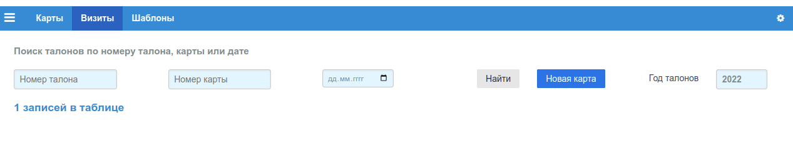
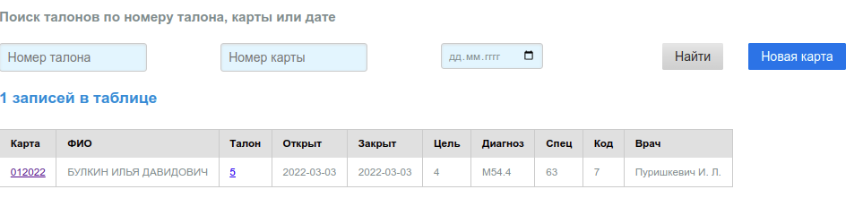

# Поиск талонов, новая карта

Пункт **"Визиты"** основного меню приложения:

На странице выводится общее количество записей в таблице. Поиск выполняется либо
по одному критерию (номер талона, номер карты, дата), либо по нескольким, если заполнены
соответствующие поля ввода, по клику на кнопку *"Найти"*.

Форма для заполнения новой карты открывается по клику
на кнопку [**"Новая карта"**](cards_edit.md).

## Год талонов

По умолчанию при загрузке приложения в браузер годом талонов считается текущий год.
При необходимости работы с талонами предыдущих периодов, в поле *"Год талонов"*
нужно выбрать соответствующий год.

Если в БД нет соответствующей таблицы талонов за указанный год, выводится сообщение
об ошибке.

## Список найденных талонов

Если все поля формы не заполнены, то поиск талонов ограничивается просто выводом
первых 50-ти записей таблицы текущего года. Найденные талоны (первые 50 записей)
выводятся в виде таблицы:

Первая колонка *"Карта"* содержит ссылку на форму редактирования данный карты. Третья
колонке таблицы *"Талон"* содержит ссылку на форму редактирования данного талона клик
по иконке открывает ["Форму редактирования талона"](./talons_edit.md).
