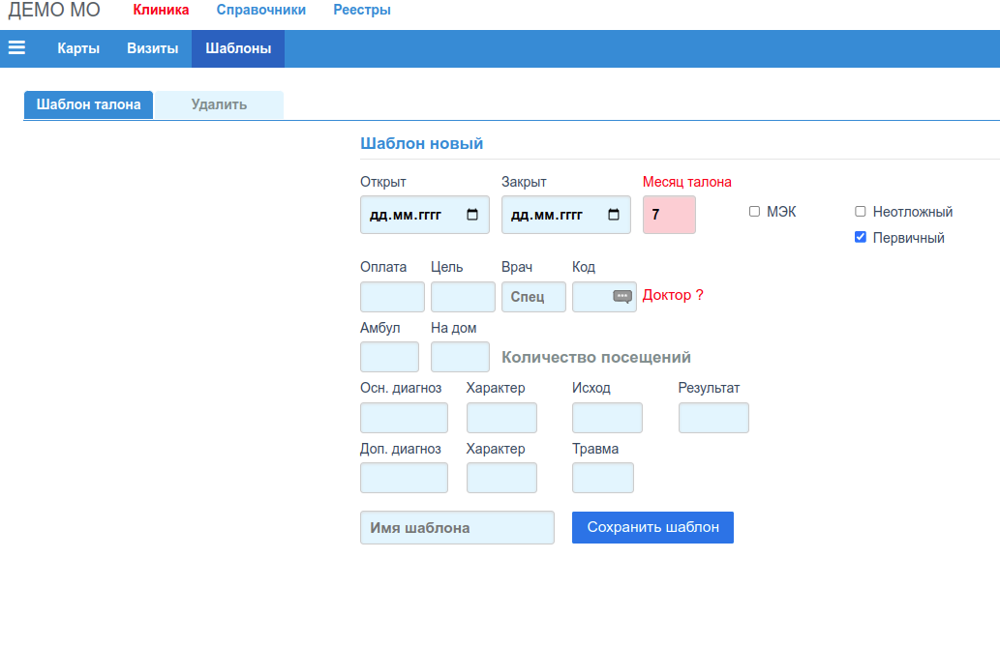

# Редактор шаблонов талонов

Для быстрого заполнения не часто изменяемых полей [формы талона](./talons_edit.md),
рекомендуется использовать *"Шаблоны талонов"*. Поля формы талона автоматически
заполняются содержимым полей заранее подготовленный шаблона талона.

## Новый шаблон талона

Форма для добавления шаблона талона:

### Вкладка "Талон"
