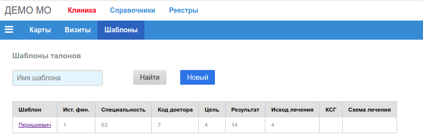

# Шаблоны талонов

Пункт **"Шаблоны"** основного меню приложения:

На странице выводится общее количество записей в таблице шаблонов. Поиск выполняется
по имени шаблона, если заполнено соответствующее поля ввода, кликом по кнопке *"Найти"*.

Форма для создания нового шаблона открывается кликом по кнопке [**"Новый"**](./tmpls_edit.md).

## Список найденных шаблонов

Первая колонка *"Шаблон"* содержит ссылку на [форму редактирования](./tmpls_edit.md)
этого шаблона.
