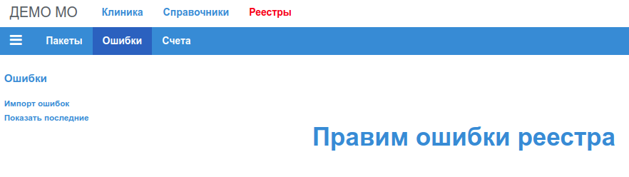
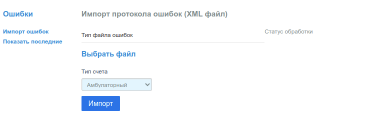
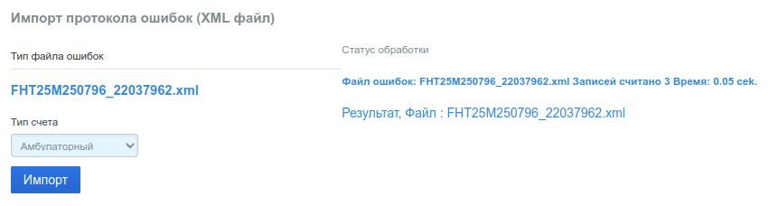
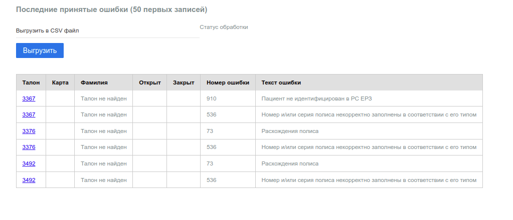

# Ошибки - Исправление ошибок в реестрах

Пункт меню "Ошибки":

## Импорт ошибок

Для корректировки талонов не принятых в МИС ТФОМС, нужно выгрузить протокол ошибок из
МИС ТФОМС и импортировать его в приложение.

Структура записи протокола ошибок МИС ТФОМС, которая импортируется приложением,
приведена в разделе [Протокол ошибок МИС ТФОМС](../../admin/tk_errors.md).

Файл протокола должен иметь расширение __"xml"__. Если из МИС ТФОМС выгружается
архивный файл __"zip"__, то перед импортом его необходимо распаковать.

Импорт протокола выполняется в форме:

В настоящей версии приложения, загрузить можно только протокол для пакета амбулаторной
помощи, поэтому в поле _"Тип счета"_ нужно выбрать _"Амбулаторный"_.

Выбор локального файла для загрузки производится кликом по строке __"Выбрать файл"__.

Импорт выполняется по клику на кнопку _"Импорт"_. На время работы программы форма
блокируется для ввода. Справа от формы располагается информационная панель в котрой
по завершении проверки выводится строка с результатом.

Например:

### Строка "Статус обработки"

В строке указано:

- имя импортированного файла;
- количество импортированных записей;
- суммарное время работы приложения.

## Показать последние - Исправление ошибок

Записи об ошибках импортируются в таблицу рабочей базы данных МО. Перед импортом,
таблица полностью очищается от всех записей.

Для просмотра таблицы импортированных ошибок нужно кликнуть по пункту меню
_"Показать последние"_.

### Таблица ошибок

В таблицу выводятся 50 первых записей из таблицы ошибок рабочей БД. Если протокол
не принимался, в таблице будут записи протокола, который был импортирован последний раз,
то есть, автоматически последние импортированные записи не удаляются, но хранятся в
таблице БД до момента очередного импорта протокола.

В таблице ошибок семь колонок:

- номер талона;
- номер карты;
- фамилия пациента;
- дата открытия талона;
- дата закрытия талона;
- номер ошибки;
- описание ошибки.

Номера талонов и карт являются гиперссылками на соответствующие талон и карту, и по клику
откроют в новой вкладке браузера форму редактирования талона/карты соответственно.

В рабочей БД МО должна присутствовать таблица с номерами и описанием ошибок, которые
генерирует МИС ТФОМС на момент выгрузки протокола. Порядок создание и обновление такой
таблицы описаны в разделе [Отказы МИС ТФОМС](../../admin/tk_errors.md#отказы-мис-тфомс)

### Выгрузка ошибок в CSV

Приложение предоставляет возможность выгрузки все таблицы принятых ошибок в текстовый
файл в формате CSV (значения, разделенные `;`). Для выгрузки нужно кликнуть по кнопке
_"Выгрузить"_.
