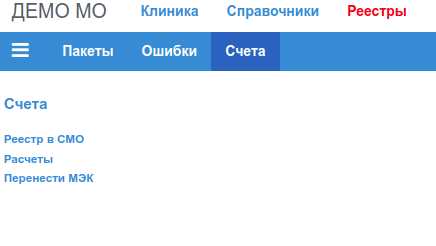
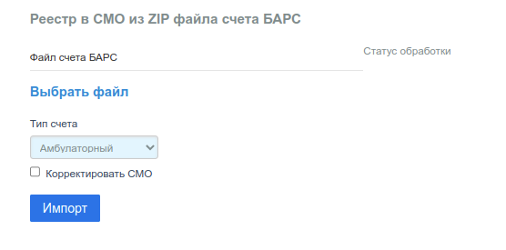
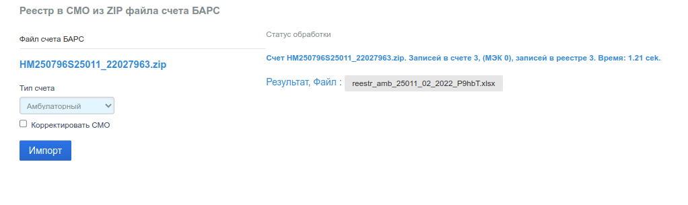
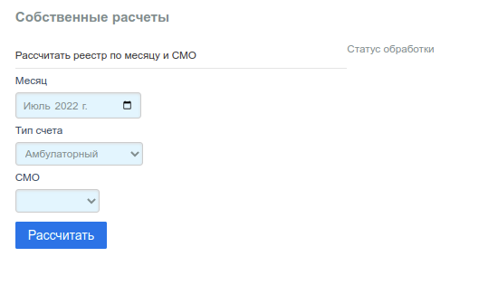
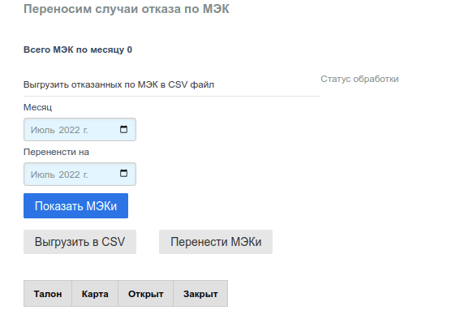

# Счета - Формирование реестров принятых пациентов для счетов в СМО

Пункт меню "Счета":

## Импорт файла счета

Для формирования XLSX файла реестра принятых пациентов (приложение с счету на оплату
услуг МО по ОМС), нужно выгрузить файл счета из МИС ТФОМС и импортировать его
в приложение.

Структура записи файла счета МИС ТФОМС, которая импортируется приложением,
приведена в разделе [Файл счета МИС ТФОМС](../../admin/invoice.md).

Файл выгруженного счета должен иметь расширение __"zip"__, то есть, это должен быть
архивный файл, включающий в себя три файла c расширением __"xml"__. Имена архива
и входящих в него файлов должны удовлетворять описанным в в разделе
[Файл счета МИС ТФОМС](../../admin/invoice.md).

Импорт счета выполняется в форме:

В настоящей версии приложения, можно сформировать только счет для амбулаторной помощи
и таблицу с ПМУ, выполненными по данному счету, поэтому в поле выбора _"Тип счета"_
следует выбирать:

1. "Амбулаторный";
2. "Инокраевые";
3. "Тарифы ПМУ".

Выбор локального файла для загрузки производится кликом по строке __"Выбрать файл"__.

Чекбокс _"Корректировать СМО"_ в действующей версии приложения не актуален, рекомендуется
оставлять его пустым.

Импорт выполняется по клику на кнопку _"Импорт"_. На время работы программы форма
блокируется для ввода. Справа от формы располагается информационная панель в которой
по завершении проверки выводится строка с результатом.

Например:

### Строка "Статус обработки"

В строке указано:

- имя импортированного файла;
- количество считанных записей (количество не принятых по МЭК);
- количество импортированных записей;
- суммарное время работы приложения.

Под строкой "Статус обработки" находится ссылка на сформированный файл счета,
кликом по которой, файл можно загрузить на локальный ПК, для дальнейшей обработки.

#### Имена формируемых файлов счетов

Сформированные файлы __"xlsx"__ именуются следующим образом.

##### Файл реестра пролеченных

    reestr_<тип>_<код_смо>_<месяц>_<год>_<суффикс>.xlsx

Где поля <***> имеют следующий смысл:

- <тип> - тип счета, актуальным является тип _"Амбулаторный"_: __amb__;
- <код_смо> - _"Код СМО"_, в которую направляется счет, по справочнику [СМО РФ](../sprav/comm.md#смо-рф-по-f002);
- <месяц> - 2 цифры месяца выгруженного счета;
- <год> - 4 цифры года выгруженного счета;
- <суффикс> - 5 случайных цифр и букв, гарантирует уникальность имени файла.

Например: __reestr_amb_25011_02_2022_P9hbT.xlsx__

##### Файл выполненных ПМУ

    tarifs_<код_мо>_<месяц>_<год>_<суффикс>.xlsx

Где поля имеют тот же смысл что и для файла счета.

Например: __tarifs_25011_02_2022_euyt.xlsx__

## Расчеты

Приложение предназначено для выполнения предварительных расчетов стоимости услуг
по ОМС, оказанных пациентам в МО, в выбранных период времени (месяц).

В действующей версии приложения не гарантируется корректность расчетов, по этой причине
не рекомендуется использовать данную функциональность.

Форма заполняемая для расчета:

Поля:

- _"Месяц"_ - месяц за который требуется выполнить расчет:
- _"Тип счета"_ - аналогично форме [Импорт счета](#импорт-файла-счета)
- _"СМО"_ - СМО для которой требуется выполнить расчет.

Расчет выполняется кликом по кнопке _"Рассчитать"_

По окончании расчета, если имеются рассчитанные талоны, под строкой "Статус обработки"
будет находится ссылка на сформированный файл счета, кликом по которой, файл можно
загрузить на локальный ПК, для дальнейшей обработки.

## Перенос отказов по МЭК

В выгруженном из МИС ТФОМС файле счета, возможно, будут находится записи реестра не
принятые к оплате, после проведения Медико-Экономического Контроля (МЭК).

В такие записи таблицы талонов БД при импорте счета будет проставлен признак МЭК,
что будет видно при [Редактировании талона](../clinic/talons_edit.md#мэк).

Не принятые по МЭК записи следует исправить и направить в МИС ТФОМС повторно в следующем
отчетном месяце. Если таких записей не много, это можно сделать вручную. Однако, бывают
ситуации, когда по МЭК отказывают большое количество записей, и не требуется их корректировка.

В таком случае, можно воспользоваться приложением, и массово перенести такие записи в
следующий за отчетным месяц.

Форма переноса по МЭК:

В поле _"Месяц"_ нужно выбрать месяц, с МЭКами которого будут выполняться операции, и
кликнуть по кнопке _"Показать МЭКи"_.

Если для выбранного месяца в БД есть талоны с МЭК, в таблице под формой будут
выведены первые 50 записей. Колонки таблицы:

- номер талона;
- номер карты;
- дата открытия талона;
- дата закрытия талона.

Номера талонов и карт являются гиперссылками на соответствующие талон и карту, и по клику
откроют в новой вкладке браузера форму редактирования талона/карты соответственно.

Под кнопкой _"Показать МЭКи"_ располагаются кнопки:

- _"Выгрузить в CSV"_;
- _"Перенести МЭКи"_.

### Выгрузка МЭКов в CSV файл

Клик по кнопке _"Выгрузить в CSV"_, запустит выборку и формирование текстового файла
формата CSV, в котором будут содержаться записи таблицы талонов с отметкой МЭК за
выбранный месяц.

По окончании формирования, под строкой "Статус обработки" будет находится ссылка
на сформированный файл, кликом по которой, файл можно загрузить на локальный ПК,
для дальнейшей обработки.

### Перенос МЭК

Для того, чтобы массово перенести талоны с МЭК с выбранного месяца на следующий, в поле
_"Перенести на"_ формы, нужно выбрать месяц на который будут перенесены отказанные записи.

Фактически перенос представляет из себя, изменение поля _"Месяц талона"_. Вместо выбранного
месяца, в это поле будет проставлен номер месяца, на который переноситься талон.

Приложение контролирует перенос только вперед. После переноса следует убедится, что
месяц талона действительно изменился, и отметка МЭК имеется в талоне.

Механизм повторного предоставления записай в МИС ТФОМС не ограничен только отказами по МЭК,
возможно в МО имеются основания для повторного предоставления по другим обстоятельствам.
В таком случае, также рекомендуется воспользоваться механизмом МЭК.

Собственно отметка МЭК в талоне, предназначена только для того, чтобы в файле реестра
загружаемого в МИС ТФОМС, указанная запись имела значение поля __"ПРИЗНАК_НОВОЙ"__
(PR_NOV), установленное в __"1"__, то есть запись предоставляется повторно.
