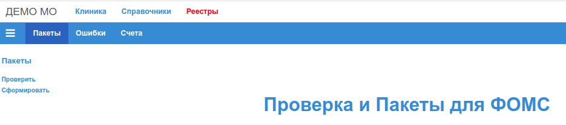
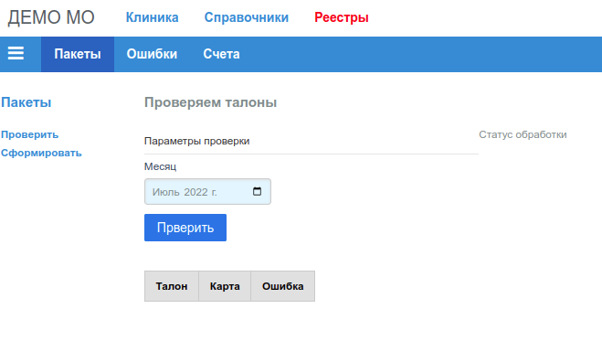
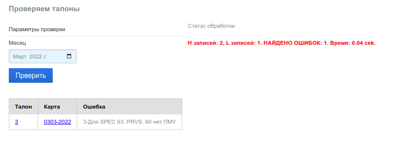
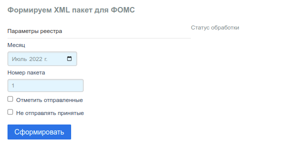
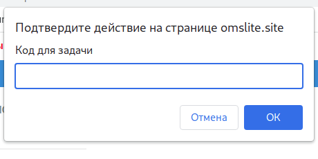
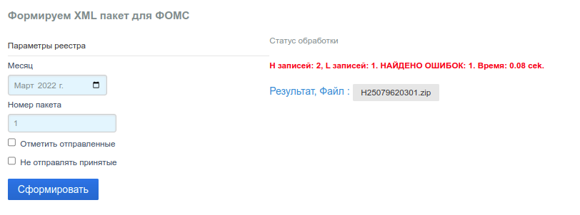

# Пакеты - Формирование пакетов для МИС ТФОМС

Пункт меню "Пакеты":

## Проверка пакетов - Проверяем талоны

Проверка подготовленных для текущего отчета талонов выполняется в форме:

Проверка талонов и формирование пакетов выполняются одной и той же программой,
единственная разница в том, что при проверке собственно *ZIP* пакет не формируется.

Для проверки нужно выбрать месяц талонов, которые будут проверяться, и кликнуть по кнопке
*"Проверить"*. На время работы программы форма блокируется для ввода. Справа от формы
располагается информационная панель в котрой по завершении проверки выводится строка с
результатом. Если найдены ошибки, под формой заполняется таблица, в которой указаны
номера карт и талонов, в которых найдены ошибки.

Например:

### Строка "Статус обработки"

В строке указано:

- количество записей, которе будет находится в файле __H\*.xml__ сформированного пакета;
- количество записей, которе будет находится в файле __L\*.xml__ сформированного пакета;
- количество найденных ошибок;
- суммарное время работы приложения.

Форматы и описания информационных файлов __H\*.xml__ и __L\*.xml__, соответствуют
справочнику ФФОМС [__Q018__](http://nsi.ffoms.ru).

### Таблица ошибок

В таблице ошибок три колонки:

- номер талона;
- номер карты;
- описание.

Номера талонов и карт являются гиперссылками на соответствующие талон и карту, и по клику
откроют в новой вкладке браузера форму редактирования талона/карты соответственно.

#### При проверке основная ошибка

__"Для SPEC 63, PRVS. 60 нет ПМУ"__ - сообщает о том, что для рентгенолога в талоне нет
исследования, которое он проводил (нет ПМУ исследования). Для исправления данной ошибки,
просто добавьте вид исследования из справочника [ПМУ](../sprav/pmu.md), на вкладке ПМУ
формы [редактора талона](../clinic/talons_edit.md#вкладка-пму).

## Формирование пакетов

Формирование *ZIP* архива пакета выполняется в форме:

Для формирования нужно выбрать месяц талонов, которые будут включены в реестр.

### Имена файлов

Правила формирования имен файлов формируемых приложением определены
[Приказом ФФОМС №173](https://rulaws.ru/acts/Prikaz-FFOMS-ot-30.08.2019-N-173/).

В приложении формируется *ZIP* архив из трех файлов:

- __HM<код_файла>.xml__ - Реестр записей амбулаторного приема
- __LM<код_файла>.xml__ - Персональные данные пациентов
- __PM<код_файла>.xml__ - Дополнительные данные о приемах

Структура __<код_файла>__ состоит из полей:

- *(Код МО)* по справочнику [МО РФ](../sprav/comm.md#мо-рф-по-f003)
- __T__*(Код региона)* по справочнику [ОКАТО](../sprav/comm.md#окато-по-о002)
- Символ `_`
- 2 последние цифры отчетного года: (00-99)
- 2 цифры отчетного месяца: (01-12)
- *(Короткий код МО)* по справочнику [МО локальные](../sprav/local.md#мо-локальные)
- Последняя цифра номера пакета: (0-9)

Например файл с именем __HM250999T25_21119991.xml__ формирован для:

1. *Код МО*: __250999__
2. *Регион*: __Т25__
3. *Год*: __21__
4. *Месяц*: __11__
5. *Короткий код МО*: __999__
6. *Номер пакета*: __1__

Структура фалов __H\*.xml__ и __L\*.xml__, описана в Нормативно-справочной информации (НСИ)
ТФОМС и ФФОМС ([__Q018__](http://nsi.ffoms.ru)). Файл __P\*.xml__ обязателен для сдачи
только в Приморском крае.

Имя формируемого пакета: __H<код_пакета>.zip__

Структура __<код_пакета>__ состоит из полей:

- *(Код МО)* по справочнику [МО РФ](../sprav/comm.md#мо-рф-по-f003)
- последняя цифра отчетного года: (0-9)
- 2 цифры отчетного месяца: (01-12)
- Номер пакета 2 цифры: (00-99)

Например пакет с именем __H25099911101.zip__ формирован для:

1. *Код МО*: __250999__
2. *Год*: __1__ (11, 21, 31 год)
3. *Месяц*: __11__
4. *Номер пакета*: __01__

### Номер пакета

В поле *Номер пакета* формы нужно указать 1 или 2 цифры номера формируемого пакета.

### Отправленные и принятые талоны

В форме формирования есть 2 чекбокса:

- Отметить отправленные
- Не отправлять принятые

#### Отметить отправленные

Если чекбокс установлен (есть галочка), в этом случае все талоны, которые попадут в пакет,
будут отмечены в базе данных как [Закрытые](../clinic/talons_edit.md#статус-талона)

#### Не отправлять принятые

Если чекбокс установлен (есть галочка), в этом случае все талоны, которые имеют статус
[Закрытые](../clinic/talons_edit.md#статус-талона) не попадут в формируемый пакет

Таким образом, если чекбоксы пустые, то все талоны месяца, попадают в отчет.
Если установлены оба чекбокса, то в отчет попадут только открытые талоны, то есть,
те, которые еще ни разу в отчет не попали, либо в талоне были исправлены
[Ошибки](./errors.md).

При формировании реальных отчетов рекомендуется всегда устанавливать оба чекбокса для
того, чтобы каждый случай (талон) был принят в МИС ТФОМС только один раз. Повторное
предоставление уже принятого случая считается ошибкой.

#### Подтверждение действия

Для того, чтобы избежать случайного клика по кнопке *"Сформировать"*, после такого
клика пользователь должен подтвердить действие в нативном окне подсказки браузера
"Подтвердите действие на странице".

Код подтверждения - Имя (Ник) пользователя, под которым он вошел в приложение. Расположен
в правом верхнем углу страницы приложения.

### Статус обработки

После ввода кода подтверждения приложение формирует пакет. На время работы программы
форма блокируется для ввода. Справа от формы располагается информационная панель
в котрой по завершении проверки выводится строка [Статус обработки](#статус-обработки).

Если найдены ошибки, то ошибочные талоны не попадут в пакет, все остальные талоны в
пакет попадут.

Под строкой "Статус обработки" находится ссылка на сформированный файл архива,
кликом по которой, архив можно загрузить на локальный ПК, для дальнейшей загрузки
в МИС ТФОМС.
