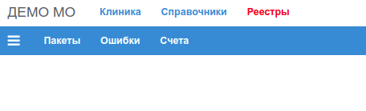

# Реестры (реестры в ТФОМС и счета в СМО)

Приложение "Реестры" предназначено, для формирования *ZIP* пакетов, загружаемых в
региональные системы ТФОМС для сдачи отчтности (МИС ТФОМС). Актуальная версия
приложения была разработана для сдачи отчетнсти в МИС ТФОМС Приморского края РФ.

Поскольку, структура и содержание архивных файлов отчета, определяются правилами,
установленными в документах территориальных ФОМС, приложение не является универсальным,
но вполне может быть адаптировано для формирования таких пакетов в любом регоне РФ.

Основой для формирования пакетоя является библиотека [**barsxml**](../../admin/barsxml.md) с открытым исходным кодом написаная на языке программирования (ЯП) Python.
Приложения [**task_rest**](../../admin/task_rest.md), которое использует эту билиотеку,
также написан на ЯП Python.

Вид основного меню Приложения:

Приложение выполняются три типа задач:

1. [Пакеты - Формирование пакетов](./packs.md);
2. [Ошибки- Исправление ошибок](./errors.md);
3. [Счета - Формирование рестров пациентов для счетов в СМО](./invoice.md)
