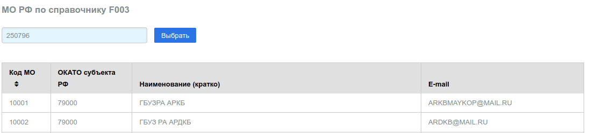
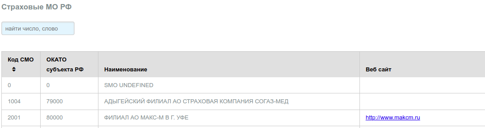
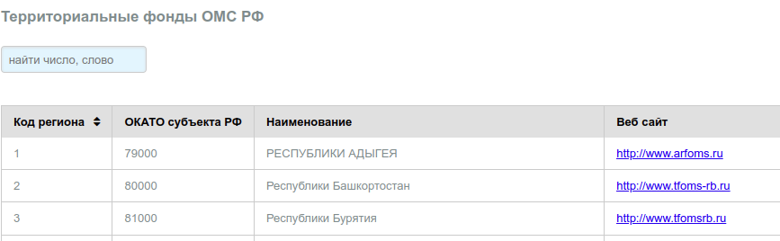
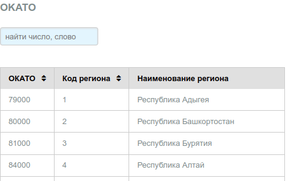
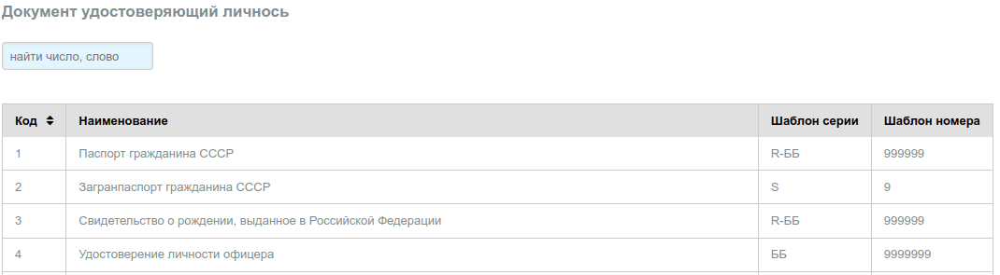

# Общие справочники

## МО РФ по F003

В справочнике перечислены МО РФ, оказывающих услуги пациентам в рамках ОМС. Справочник
выгружен из файла федерального справочника [F003](http://nsi.ffoms.ru) по состоянию на 2020 г. Справочник не редактируется.

---

## СМО РФ по F002

В справочнике перечислены СМО РФ, оказывающих услуги страхования в рамках ОМС. Справочник
выгружен из файла федерального справочника [F002](http://nsi.ffoms.ru) по состоянию на 2020 г.
Справочник не редактируется.

---

## ФОМС РФ по F001

В справочнике перечислены территориальные ФОМС РФ. Справочник выгружен из файла
федерального справочника [F001](http://nsi.ffoms.ru) по состоянию на 2020 г. Справочник
не редактируется.

---

## ОКАТО по О002

В справочнике перечислены ОКАТО РФ (коды). Справочник выгружен из файла федерального
справочника [О002](http://nsi.ffoms.ru) по состоянию на 2020 г. Справочник не редактируется.

---

## ДУЛ по F011 документ удостоверяющий личность

В справочнике перечислены коды ДУЛ используемые ФОМС для указания типа документа пациента
при обращении в МО в рамках ОМС. Справочник выгружен из файла федерального справочника
[F011](http://nsi.ffoms.ru) по состоянию на 2020 г. Справочник не редактируется.

---
