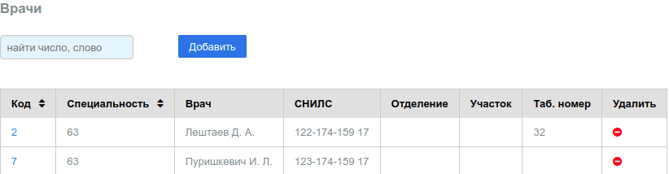
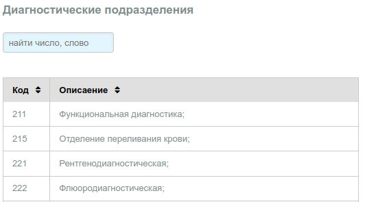
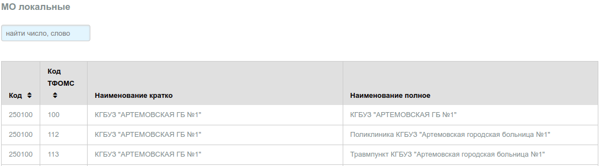
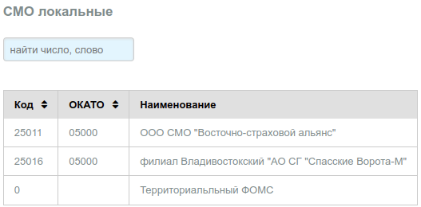

# Локальные справочники

## Врачи

В справочнике указаны врачи МО, оказывающие услуги пациентам в рамках ОМС.
Необходимо добавить в в спраочник хотя бы одного доктора, который будет вести прием
пациентов в МО по ОМС.

Справочник допускает изменение и удаление записей.

Вид справочника:

---

## Диагностические подразделения

Данный справочник в настоящее время скорее всего не актуален, оставлен для
обратной совместимости.

Вид справочника:

---

## МО локальные

Справочник формируется путем загрузки в таблицу сведений выбранных из федерального
справочника **F003_xxx.xml - реестр МО РФ**, и актуальных для субъекта РФ в котором данное
МО примиает участие в программе ОМС. Автоматизированная выборка неоходимых записей
и загрузка справочника для субъекта в настоящее время не реализована.

Вид справочника:

---

## СМО локальные

Справочник формируется путем загрузки в таблицу сведений выбранных из федерального
справочника **F002_xxx.xml - реестр СМО РФ**, и актуальных для субъекта РФ в котором данное
МО примиает участие в программе ОМС. Автоматизированная выборка неоходимых записей
и загрузка справочника для субъекта в настоящее время не реализована.
В таблице имеется специальная запись с кодом СМО **0 - Территориальный ФОМС**, которая,
предназначена для формирования счетов по межтерриториальным расчетам.

Вид справочника:

---

