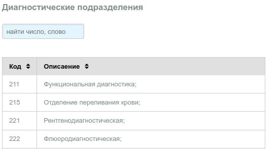
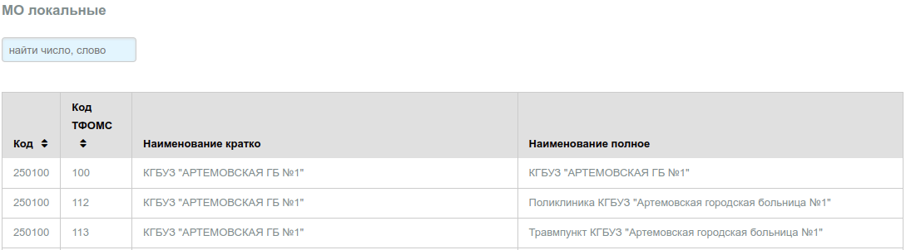
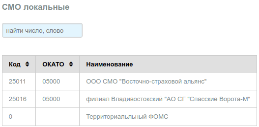
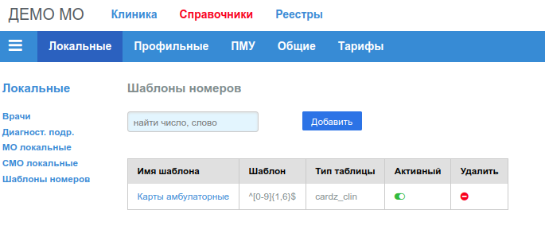

# Локальные справочники

## Врачи

В справочнике указаны врачи МО, оказывающие услуги пациентам в рамках ОМС.
Необходимо добавить в в справочник хотя бы одного доктора, который будет вести прием
пациентов в МО по ОМС.

Справочник допускает изменение и удаление записей.

Вид справочника:

---

## Диагностические подразделения

Данный справочник в настоящее время скорее всего не актуален, оставлен для
обратной совместимости.

Вид справочника:

---

## МО локальные

Справочник формируется путем загрузки в таблицу сведений выбранных из федерального
справочника [**F003 - реестр МО РФ**](http://nsi.ffoms.ru), и актуальных для субъекта РФ в котором данное
МО принимает участие в программе ОМС. Автоматизированная выборка необходимых записей
и загрузка справочника для субъекта в настоящее время не реализована.

Вид справочника:

---

## СМО локальные

Справочник формируется путем загрузки в таблицу сведений выбранных из федерального
справочника [**F002 - реестр СМО РФ**](http://nsi.ffoms.ru), и актуальных для субъекта РФ в котором данное МО принимает участие в программе ОМС. Автоматизированная выборка
необходимых записей и загрузка справочника для субъекта в настоящее время не реализована.
В таблице имеется специальная запись с кодом СМО **0 - Территориальный ФОМС**,
которая, предназначена для формирования счетов по межтерриториальным расчетам.

Вид справочника:

## Шаблоны номеров

Номера карт, создаваемых в приложении [Клиника](../clinic/cards_edit.md), возможно,
должны соответствовать определенному шаблону. Например, первые (или последние) 2 цифры
номера должны соответствовать году в котором карта была заведена, или в номере содержаться
определенные сочетания букв (латинских), цифр и/или символы "-" или "_" и т.д.
При сохранении карты в БД, приложение проверяет соответствие номера заданному шаблону.
Для управления шаблонами создан справочник "Шаблоны номеров".

В настоящее время контролируются номера только карт амбулаторных пациентов приложения
"Клиника". Шаблон номера задается текстовой строкой в виде "регулярного выражения"
POSIX. Допустимые в выражении символы:

    ][^$.,|?*+.{}0-9A-Za-z_-

Шаблоны хранятся в БД в виде текстовой строки, при сохранении которой, сервер БД проверяет
сохраняемое значение на наличие только допустимых символов. Если в строке находится
не допустимый символ возникает ошибка.

Вид справочника:

При создании шаблона, существенными являются поля:

- **Шаблон** - собственно строка шаблона;
- **Тип таблицы** - в настоящее время необходимо указывать только 'cardz_clin';
- **Активный** - если шаблон не активный он не участвует в выборке шаблонов из таблицы.

Как указано выше, если поле "Тип таблицы" отличается от значения **'cardz_clin'**, то
этот шаблон не будет применятся к номеру карты.

Используется следующий алгоритм выбора шаблона:

1. Из таблицы выбирается **первый** активный шаблон с типом **cardz_clin**
2. Если такой шаблон не найден (шаблон вообще не задан, или нет подходящего),
то устанавливается шаблон по умолчанию.

По умолчанию используется следующий шаблон:

    /^[0-9]{1,7}$/

то есть, последовательность любых цифр, длина последовательности от 1 до 7 символов,
например:

    минимальная длина - 3, максимальная - 1234560

---
