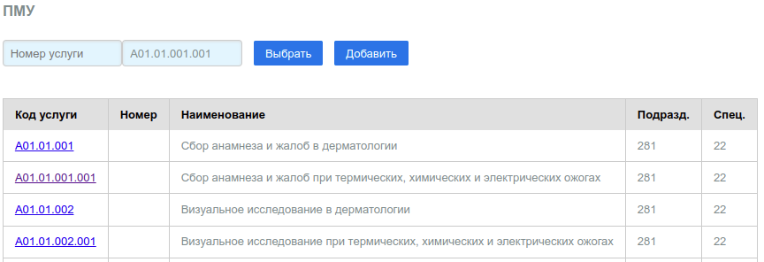
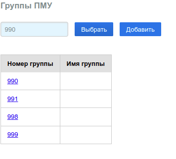
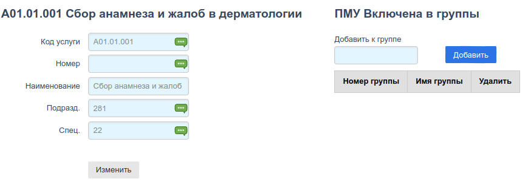
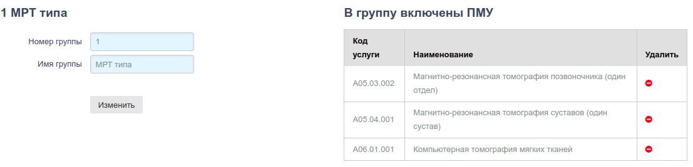

# ПМУ (Простые мед. услуги)

## ПМУ

Справочник содержит перечень простых мед. услуг, в нотации кодов Приказов МЗ РФ
**"Номенклатура медицинских услуг"** выполнение которых принимается или не
принимается к оплате по ОМС в ТФОМС субъекта РФ. Демо справочник сформирован для
Приморского края РФ и актуален на 2020 год. Вид таблицы:

Описание:

Поле | Назначение
---- | --------
Код услуги | Код услуги в нотации "Номенклатура медицинских услуг" МЗ РФ
Номер | Произвольное число, сопоставляющее код номенклатуры данному номеру
Наименование | Описание услуги по "Номенклатура медицинских услуг" МЗ РФ
Подразд. | Номер подразделения МО, в котором услуга выполняется (не актуально)
Спец. | Код специальности мед работника выполняющего услугу

Поля *Подразделение* и *Специальность* нужно заполнять (если заполнять) в соответствии со
справочниками [Подразделения](./local.md#диагностические-подразделения) и
[Специальности](./prof.md#специальности) соответственно.

Поиск услуг можно выполнять либо по номеру, если он есть, либо по коду. Соответствующие
поля ввода расположены над таблицей. Для поиска услуги по коду, необходимо ввести в поле
поиска не менее 3 символов. Справочник позволяет добавлять новые услуги.

Изменять услуги можно на [специальной странице](#редактор-пму) которая открывается по
клику на код услуги, который в данной таблице представляет собой ссылку на страницу
редактирования данной услуги.

---

## Группы ПМУ

ПМУ можно группировать. Для группировки существует справочник групп. Группа представляет
собой просто запись с номером и описанием группы. В любую группу можно добавить любое
количество простых услуг, либо по номеру либо по коду услуги.

Редактировать группы можно на [специальной странице](#редактор-групп-пму) которая открывается
по клику на номер группы, который в данной таблице представляет собой ссылку на страницу
редактирования данной группы.

---

## Редактор ПМУ

Следует иметь в виду, что **в Демо БД, пользователь не имеет прав на редактирование ПМУ**.

Страница редактора имеет вид:

Все поля формы редактирования услуги доступны для изменения. Для того, чтобы добавить
услугу к определенной группе, нужно ввести номер группы в поле формы *"Добавить к группе"*
число и кликнуть по кнопке *"Добавить"*

Для удаления услуги из группы в таблице *"ПМУ Включена в группы"* правой части фомы,
в последней колонке, нужно кликнуть на метку `-`, ПМУ будет удалена.

---

## Редактор групп ПМУ

Следует иметь в виду, что **в Демо БД, пользователь не имеет прав на редактирование групп ПМУ**.

Страница редактора имеет вид:

Все поля формы редактирования группы доступны для изменения.

Для удаления ПМУ из группы в таблице *"В группу включены ПМУ"* правой части фомы,
в последней колонке, нужно кликнуть на метку `-`, ПМУ будет удалена из группы.

---
