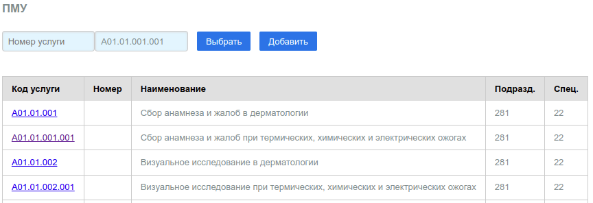
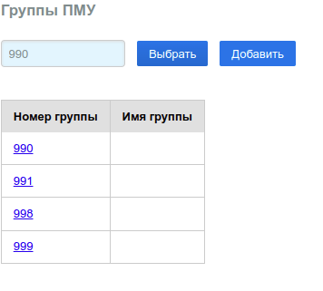

# ПМУ (Прстые мед. услуги)

## ПМУ

Справочник содержит перечень простых мед. услуг, в нотации кодов Приказов МЗ РФ
**"Номенклатура медицинских услуг"** выполнение которых принимается или не
принмается к оплате по ОМС в ТФОМС субъекта РФ. Демо справочник сформирован для
Приморского края РФ и актуален на 2020 год. Вид таблицы:

Описание:

Поле | Назначение
---- | --------
Код услуги | Код услуги в нотации "Номенклатура медицинских услуг" МЗ РФ
Номер | Произвольное число, сопоставляющее код номенклатуры данному номеру
Наименование | Описание услуги по "Номенклатура медицинских услуг" МЗ РФ
Подразд. | Номер подразделения МО, в котором услуга выполняется (не актуально)
Спец. | Код специальности мед работника выполняющего услугу

Поля *Подразделение* и *Специальность* нужно заполнять (если заполнять) в соответсвии со
справочниками [Подразделения](./local.md#диагностические-подразделения) и
[Специальности](./prof.md#специальности) соответственно.

Поиск услуг можно выполнять либо по номеру, если он есть, либо по коду. Соответсвующие
поля ввода расположены над таблицей. Для поска услуги по коду, необходимо ввести в поле
поиска не менее 3 символов. Справочник позволяет добавлять новые услуги.

Изменять услуги можно на специальной странице, которая открывается по клику на код услуги,
который в данной таблице представляет собой ссылку на страницу редакитрования данной услуги.

---

## Группы ПМУ

ПМУ можно группировать. Для группировки существует справочник групп. Группа представляет
собой просто запись с номером и описанием группы. В любую группу можно добавить любое
количество простых услуг, либо по номеру либо по коду учслуги.

