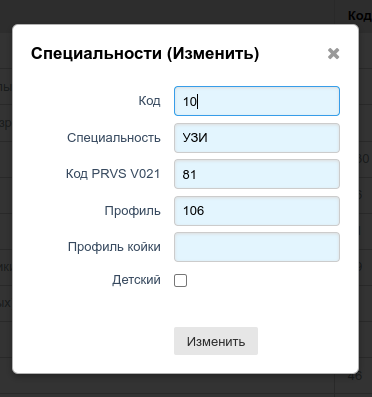
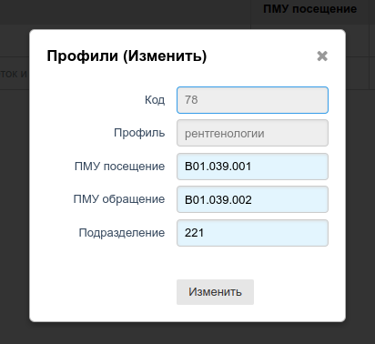
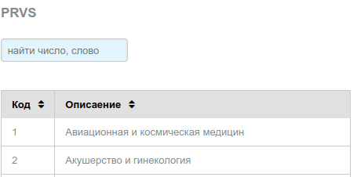
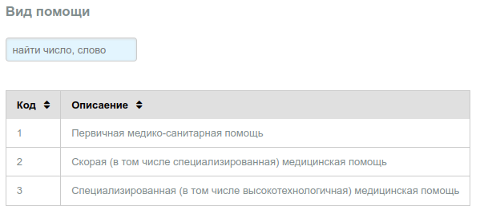
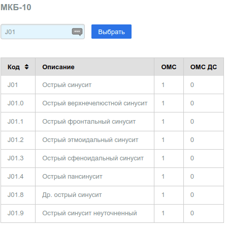

# Профильные справочники

## Специальности

В справочнике указаны специальности врачей, оказывающих услуги пациентам в рамках ОМС.
Справочник позволяет добавлять и корректировать записи, удаление записей не реализовано.
Записи имеют следующую структуру:

Описание:

Поле | Назначение
---- | --------
Код   | Абстрактное число к которму можно привязать все остальные поля
Специальность | Текстовое поле специальность
Код PRVS | Код признака врачебной специальности из федерального справочника *V021*
Профиль | Код профиля мед. помощи для данного кода PRVS: федеоральный справочник *V002*
Профиль койки | Только для стационарной помощи (в данном контексте не актуально)
Детский | Профиль помощи включает прием детей (в данном контексте не актуально)

Фактически для диагностических исследований актуальными являются только поля:

- Код
- Код PRVS
- Профиль

Допустим, для специальности **"Рентгенолог"** мы выбрали код 63 (это точное число),
к данному (фактически нашему внутреннему для системы) коду мы привязали:

- Код PRVS: 60 (Рентгенология)
- Профиль: 78 (Рентгенология)

Таким образом ссылаясь только на код 63, мы фактически ссылаемся на 2 числа (60, 78)

---

## Профили

Федеральный сравочник *V002 Профили помощи*. Для каждого профиля имеется возможность
указать специфические услуги по однократному (посещение) или многократнуму (обращиение)
приему пациента донным специалистом.

Коды приема (ПМУ) в данной версии системы характерны толко для отчетов по ОМС,
сдаваемых в ТФОМС Примроского края РФ. Возможно в других субъектах эти коды либо
вообще не употребляются, либо другие. Поле **"Подразделение"** не актуально, и
оставлено для обратной совместимости (чтобы это не значило).

---

## PRVS

Федеральный сравочник *V021 Признак врачебной специальности*. Справочник формируется
путем загрузки в таблицу сведений выбранных из федерального справочника, и актуальных
для данного МО. Автоматизированная выборка неоходимых записей и загрузка справочника
в настоящее время не реализована.

---

## Вид помощи

Федеральный сравочник *V008 Классификатор видов медицинской помощи*. Справочник
формируется путем загрузки в таблицу сведений выбранных из федерального справочника,
и актуальных для данного МО. Автоматизированная выборка неоходимых записей и загрузка
справочника в настоящее время не реализована.

---

## МКБ-10

Сравочник *МКБ-10 Классификатор диагнозов*. Справочник сформирован из имеющихся в сети
интернет готовых справочников МКБ основанных на международном классификаторе заболеваний
**ICD-10 Version:2019**. В таблицу загружены сведения из таких свобдно распространяемых справочников. Автоматизированная загрузка справочника в настоящее время не реализована.

Для поиска кода дагноза в таблице, необходимо ввести не менее 3 символов кода в поле поиска
и кликнуть по кнопке **"Выбрать"**.

В таблице присутсвут 2 дополнительные колонки (значение: 0 - нет, 1 - да):

- ОМС - оплачвается ли амбулаторное лечение с данным диагнозом по ОМС
- ОМС ДС - оплачивается ли лечение с данным дмагнозом в дневном стационаре по ОМС

---
