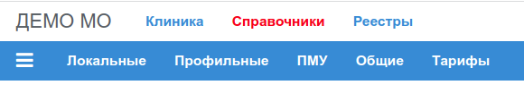
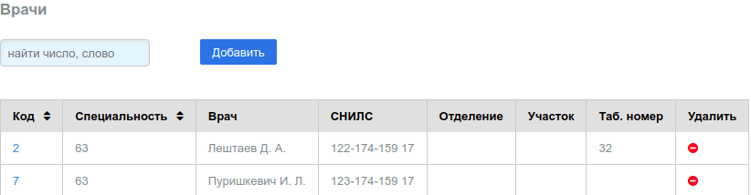
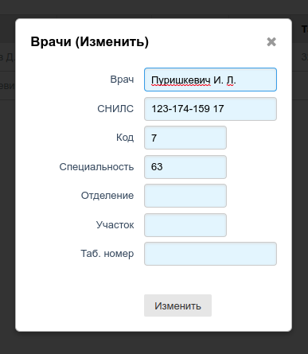

# Справочники БД

Вид основного меню Приложения:

Справочники разделены на группы:

1. [Локальные](./local.md) (для данного МО, региона РФ)
2. [Профильные](./prof.md) (специальные для системы ОМС РФ)
3. [ПМУ](./pmu.md) (простые мед. услуги ОМС)
4. [Общие](./comm.md) (Окато, МО РФ, СМО РФ)
5. [Тарифы](./tarif.md) (тарифы на услуги оплачивыемые в рамках ОМС в субъекте РФ)

Часть справочников можно редактировать, часть необходимо загружать в базу в готовом виде.

Содержание справочников выводится в виде таблиц, в котрых отображаются **первые 50 записей**
справочника. Часть колонок таблицы можно сортирвать по убыванию или возрастанию.
В заголовках сортруемых колонок есть специальный значок **`^`**, кликая по такому
заголовку можно сортирвать строки таблицы.

В некоторых таблицах можно выполнять поиск по содержимому строк таблицы. Перед
заголовком таких таблиц помещен элемент ввода. При вводе текста в этом элементе,
выполняется поиск по 2 или 3 колонкам таблицы во всех строках, строки, в которых текст
не найден, временно скрываются.

Отдельные справочнки предпологают добавление, изменение и удадение записей. Для добавления
записей служит кнопка **"Добавить"**, расположенная прямо над таблицей. Для удаления записей
служит специальная, последняя колонка таблицы, с кликабельным значком **`-`**. Чтобы изменить
запись необходимо клкнуть по ячейке самой первой колонки таблицы, в такой колонке как правило
находится число синего цвета - некий код для такой записи.

Пример вида таблицы с сортировкой, поиском и правкой записей:

---

Добавлении или изменение записей прозводится в всплывающем окне, в котором размещена
`html` форма для внесения или корректировки данных.

Пример формы для корректировки данных:

