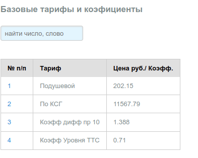
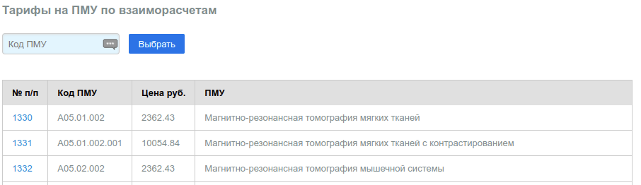

# Тарифы

Следует иметь ввиду, что в **Демо БД данные справочники не редактируются**.

## Базовый

В справочнике перечислены базовые тарифы по ОМС на территории Приморского края РФ
по состоянию на 2020 г.

---

## ПМУ взаиморасчеты

В справочнике перечислены тарифы действовавшие на территории Приморского края РФ
в 2020 г. По приведенным тарифам производились взаиморасчеты между МО за услуги
КТ и МРТ диагностики в рамках ОМС.

---
